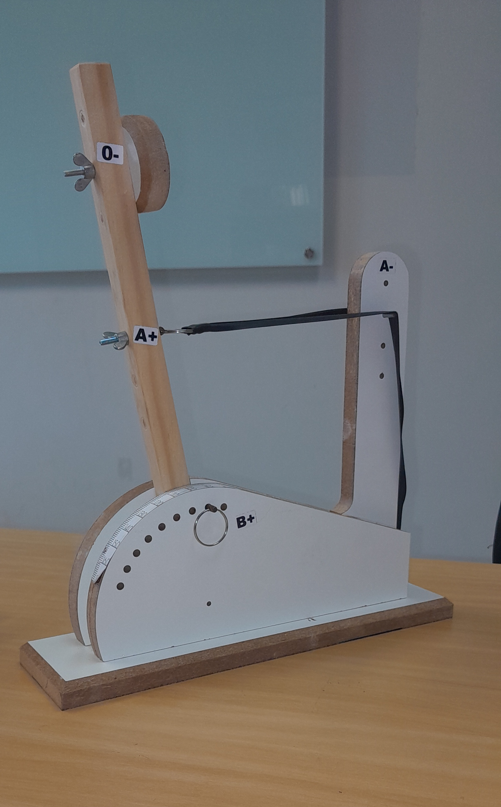

## 📌 Introdução e Objetivo

O relatório explica o experimento realizado em aula, com foco na analise de dados coletados após lançamentos efetuados com a catapulta. O objetivo principal é verificar a variações dos lançamentos sob a mesma configuração da catapulta.

## 📚 Prática Experimental

O experimento da catapulta serve como uma coleta real de dados, para a aplicação de tecnicas de analise. A catapulta utilizada possui diferentes formas de configuração, podendo alterar variaveis como a tensão do elastico, o angulo da catapulta, entre outros.

### Configuração Utilizada

Imagem da catapulta

{width=40%}

Para efetuar os lançamentos, foram utilizados a seguintes configuracões na catapulta

*   **Posição O-**: Nível 2
*   **Posição A+**: Nível 3
*   **Posição B+**: 90°
*   **Posição A-**: Nível 4

Sendo a posição O-, o local onde a bolinha e colocada, a posição A+ sendo onde o elastico é preso no braço da catapulta, a posição B+ a angulação maxima que a catapulta solta a bolinha, e a posição A- sendo o nivel de pressão do elastico.

## ⚙️ Coleta de Dados

Foram feitos 22 lançamentos com a catapulta nas configurações mencionadas acima, foi obtido diferentes distancias da bolinha, variando de 276.4 cm até 326 cm. 

### Tabulação dos Dados obtidos

Para facilitar a analise dos dados obtidos, utilizaremos a tabulação de dados, usando o `leem` . O pacote `leem` permite a leitura e organização dos dados em formato tabular, facilitando a análise estatística, como cálculo de frequências e visualização estruturada dos dados.

Siga exemplos de como fazer isso utilizando o `leem` .

#### Leitura dos dados
```r
dados <- leem("arquivo.csv")

```
É importante que os arquivo onde está os dados esteja em .csv para que funcione.

#### Tabulação dos dados
```r
table(dados$distancia)

```

Criar uma tabela
```r
tab(dados)

```
#### Dados brutos coletados


**Dados brutos cm:**
`326.0, 294.8, 296.8, 294.0, 295.8, 298.5, 300.6, 285.1, 287.1, 292.3, 290.8, 287.9, 282.9, 285.3, 281.5, 278.4, 276.4, 281.7, 277.1, 285.3, 277.1, 281.8`

**dados organizados em ordem crescente em cm:**
`276.4, 277.1, 277.1, 278.4, 281.5, 281.7, 281.8, 282.9, 285.1, 285.3, 285.3, 287.1, 287.9, 290.8, 292.3, 294.0, 294.8, 295.8, 296.8, 298.5, 300.6, 326.0`

## 📊 Variações dos dados e analise

A observação de resultados diferentes, mesmo que com as configurações fixas, mostra a importância da estatística para entender as variações. Os principais fatores que contribui para essas variações são:

*   Modificações minimas na posição da catapulta;
*   Influência de fatores externos, como o clima;
*   Desgaste do eslástico da catapulta;

## 🧠 Conclusão

A partir dos dados obtidos no experimento com a catapulta, foi possível observar que, mesmo mantendo uma configuração fixa, os resultados dos lançamentos apresentaram variações consideráveis. Isso evidencia que, em experimentos práticos, pequenas mudanças nas condições iniciais ou fatores externos podem influenciar diretamente os resultados.

A utilização da tabulação de dados, com auxílio do pacote `leem` e de ferramentas do próprio R, permitiu organizar e analisar os valores coletados de forma mais clara e eficiente. Por meio dessa organização, foi possível identificar padrões, distribuições e até possíveis valores atípicos, contribuindo para uma melhor compreensão do comportamento dos dados.

Dessa forma, o experimento reforça a importância da estatística na análise de fenômenos reais, mostrando que a interpretação dos dados vai além da simples observação, sendo necessária a aplicação de métodos adequados para obter conclusões mais precisas e confiáveis.

## 📖 Referências

* [1] Bendeivide. **Estatística e Probabilidade (UFSJ)**. Disponível em: <http://bendeivide.github.io/courses/epaec/>.
* [2] Bendeivide. **Modelo de Relatório**. Disponível em: <http://bendeivide.github.io/courses/epaec/modrel/>.
* [3] Bendeivide. **Pacote `leem` (Laboratório de Ensino de Estatística e Matemática)**. Disponível em: <https://bendeivide.github.io/leem/>.
* [4] Bendeivide. **Experimentos para as aulas práticas**. Dísponivel em: <https://bendeivide.github.io/courses/epaec/normal2026.1/#experimentos>.