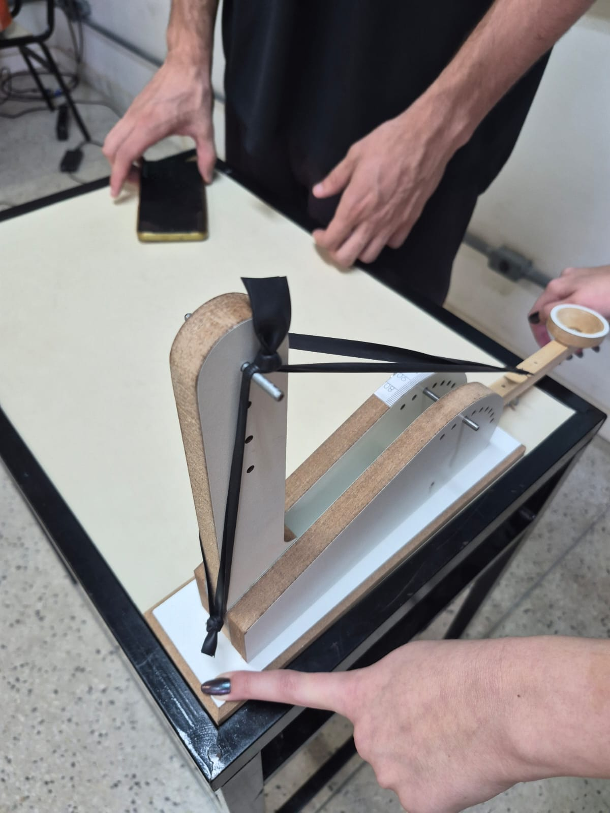
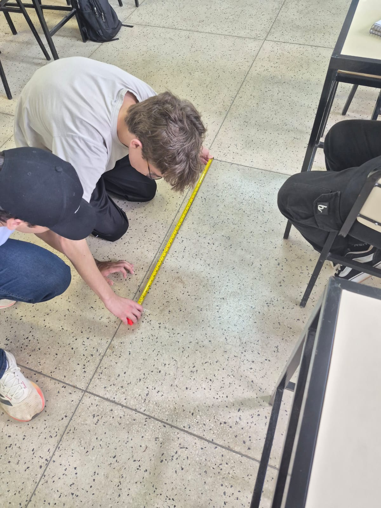
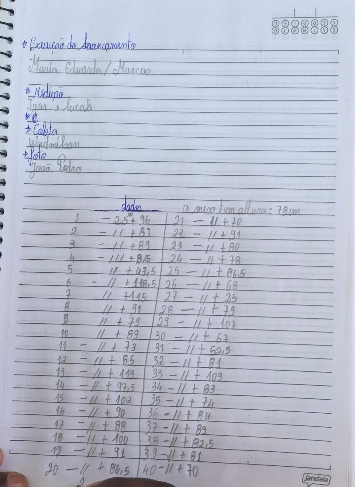

---
# Só mude aqui!!!!
author: "Marcos Vinicius e Daniel de Freitas"
title: "Relatório de Aula Prática 03"
bibliography: referencias.bib
# A partir daqui nao faca alteracoes!!!!!
link-citations: true
csl: associacao-brasileira-de-normas-tecnicas-ipea.csl
subtitle: "<a href='https://bendeivide.github.io/courses/epaec/' target='_blank'>Estatística e Probabilidade</a> </br> <a href='https://bendeivide.github.io' target='_blank'>Prof. Ben Dêivide (DEFIM/CAP/UFSJ)</a>"
include-before-body: header.html
date: now
date-format: "DD/MM/YYYY, HH:mm"
lang: pt-BR
format:
  html:
    toc: true
    number-sections: true
    theme: bootstrap
    #css: styles.css
    code-fold: true
    code-tools: true
execute:
  echo: true
  warning: false
  message: false
---


# 📌 Introdução

Neste trabalho, foi realizado um experimento utilizando uma catapulta com o objetivo de analisar estatisticamente as variações de distâncias em que ela lança uma determinada bolinha.

A turma foi dividida em dois grandes grupos, e cada grupo realizou 40 lançamentos, totalizando 40 observações por grupo.

Cada grupo trabalhou com uma configuração diferente das fontes de variação (A+, A-, O-, B+), permitindo comparar como essas variações influenciam os resultados.

O foco do relatório é aplicar conceitos de estatística descritiva, incluindo:

* Tabelas de frequência
* Gráficos
* Medidas de posição e dispersão
* Assimetria e curtose

---

# 📚  Metodologia


## Organização dos dados

Cada grupo realizou:

* 40 lançamentos;
* Medição da distância (em cm).

Os dados foram organizados em um arquivo .csv e analisados no software R, utilizando o pacote:
```r
library(leem)
```
## Configurações experimentais

Cada grupo utilizou uma configuração diferente das variaveis do experimento.

* A+ A- O- B+
Essas variaveis representam 
* A+, local onde o elastico é preso no braço da catapulta; nivel 2
* A-, nivel de pressão do elastico; nive 4
* O-, local onde a bolinha é colocada; nivel 1
* B+, angulação do braço que segura o local de por a bolinha. 100°


# Análise Descritiva

## Tabela de frequência sem agrupamento

Utilizando o pacote ´leem´:

```{r}
#| echo: true
#atribuir o pacote leem
library(leem)
#ler os dados
leitura<-read.csv2("dados.csv")
#pegar a coluna 2
dados<-leitura[,2]
#criar objeto new leem
objetonl<- new_leem(dados)
#tabela de frequencia sem agrupamento
tabfreq(objetonl)


```
Isso permite observar:

* Frequência absoluta
* Frequência relativa
* Frequência acumulada

### Tabela de frequência com agrupamento

```{r}
#| echo: true

#atribuir o pacote leem

library(leem)

#ler os dados

leitura<-read.csv2("dados.csv")

#pegar a segunda coluna

dados<-leitura[,2]

#distribuição de frequencia

dadosnl<-new_leem(dados, variable = "continuous")

#tabela de frequencia com agrupamento

tabfreq(dadosnl)

```

## Analise sobre os dados agrupados vs não agrupados.

Os dados podem ser analisados de duas formas: agrupados e não agrupados, e cada abordagem possui vantagens e limitações.

Perda de precisão:
Ao agrupar os dados em classes (intervalos), perde-se a informação exata de cada observação. Isso ocorre porque os valores individuais são substituídos por intervalos, o que introduz uma aproximação.
Medidas estatísticas podem variar:
Cálculos como média, mediana e desvio padrão podem apresentar pequenas diferenças quando comparados aos dados não agrupados. Isso acontece porque, nos dados agrupados, geralmente utilizamos o ponto médio das classes para realizar os cálculos.
Facilidade de interpretação:
Por outro lado, os dados agrupados tornam a análise muito mais clara, especialmente quando se trabalha com grandes volumes de dados. A organização em classes facilita a visualização de padrões, tendências e distribuição dos valores.

De maneira bem geral:

Se a precisão for essencial -> usar dados não agrupados. 

Se a visualização e síntese forem mais importantes -> usar dados agrupados

# Representação gráfica

## Grafico de barras

```{r}
#| echo: true

#atribuir o pacote leem

library(leem)

#ler os dados

leitura<-read.csv2("dados.csv")

#pegar a segunda coluna

dados<-leitura[,2]

#distribuição de frequencia

dadosnl<-new_leem(dados, variable = "continuous")

#representação grafica em barras

aux1<-tabfreq(dadosnl)
barplot(aux1, barcol = heat.colors(5))

```

## Poligono de frequencia

```{r}
#| echo: true

#atribuir o pacote leem

library(leem)

#ler os dados

leitura<-read.csv2("dados.csv")

#pegar a segunda coluna

dados<-leitura[,2]

#distribuição de frequencia

dadosnl<-new_leem(dados, variable = "continuous")

#Poligono de frequencia

aux1<-tabfreq(dadosnl)
polyfreq(aux1, barcol = heat.colors(5), main = "poligonos de frequencias e histograma de frequencias")
```

## Grafico de pizza

```{r}
#| echo: true

#atribuir o pacote leem

library(leem)

#ler os dados

leitura<-read.csv2("dados.csv")

#pegar a segunda coluna

dados<-leitura[,2]

#distribuição de frequencia

dadosnl<-new_leem(dados, variable = "continuous")

#Poligono de frequencia

aux1<-tabfreq(dadosnl)
piechart(aux1, main = "Grafico de pizza" )
```

### Analise dos graficos

Como podemos ver, os graficos mostram que em uma determinada classe (322.0 até 340.8), temos uma frequencia muito grande, uma massa muito grande de dados nessa região.

Observamos tambem:

* Há dados extremos, por exemplo na 1 classe;
* Se observa uma distribuição assimetrica, com concentração maior em classes maiores;


## Medidas Estatisticas

### Medidas de posição

* Média
* Mediana

```{r}
#| echo: true

#atribuir o pacote leem

library(leem)

#ler os dados

leitura<-read.csv2("dados.csv")

#pegar a segunda coluna

dados<-leitura[,2]

#Medidas de posição

mean(dados)
median(dados)
```
### Medidas de Dispersão

* Variância
* Desvio padrão
* Amplitude

```{r}
#| echo: true

#atribuir o pacote leem

library(leem)

#ler os dados

leitura<-read.csv2("dados.csv")

#pegar a segunda coluna

dados<-leitura[,2]

#Medidas de dispersão
var(dados)
sd(dados)
range(dados)

```
## Assimetria e curtose

```{r}
#| echo: true
library(e1071)
leitura<-read.csv2("dados.csv")
dados<-leitura[,2]
skewness(dados)
kurtosis(dados)
```

### Analise dos resultados

O coeficiente de assimetria apresentou valor negativo (-0,708), indicando que a distribuição dos dados é assimétrica à esquerda. Isso sugere que a maior parte dos lançamentos se concentra em valores mais altos de distância, havendo alguns valores menores que influenciam a forma da distribuição.

A curtose apresentou valor positivo (1,589), caracterizando uma distribuição leptocúrtica. Isso indica que os dados estão mais concentrados em torno da média, com um pico mais acentuado e maior probabilidade de ocorrência de valores extremos.

Dessa forma, a análise de assimetria e curtose complementa a descrição dos dados, permitindo compreender não apenas a dispersão, mas também o formato da distribuição das distâncias obtidas no experimento.

## 🧠 Considerações finais

Os resultados obtidos no experimento da catapulta permitem analisar tanto a variabilidade dos dados quanto a consistência das medições realizadas. Observou-se que os valores de alcance apresentaram pequenas variações entre os lançamentos, algo que se espera de um experimento para validar algo. 

A análise da assimetria apresentou valor negativo (-0,708), indicando que a distribuição dos dados é assimétrica à esquerda. Isso sugere que a maior parte dos lançamentos se concentra em distâncias mais elevadas, havendo alguns valores menores que influenciam a distribuição. Esse comportamento pode ser explicado por pequenas falhas na execução de alguns lançamentos, como variações na força aplicada ou na posição da bolinha.

Além disso, a curtose apresentou valor positivo (1,589), caracterizando uma distribuição leptocúrtica. Isso indica que os dados estão mais concentrados em torno da média, com um pico mais acentuado e maior probabilidade de ocorrência de valores extremos. Esse resultado reforça que, apesar de haver consistência nos lançamentos, existem algumas observações atípicas que influenciam a forma da distribuição.

### Variabilidade dos dados

A variabilidade observada pode ser explicada por diversos fatores experimentais. Como a catapulta foi construída manualmente e operada sem controle automatizado, pequenas diferenças na execução de cada lançamento influenciam diretamente os resultados. Entre esses fatores, os principais:

Variação na força aplicada ao acionar a catapulta
Pequenos deslocamentos na posição inicial do projétil
Falta de fixação na mesa

Mesmo com essas variações, se os dados não apresentarem dispersão muito grande, pode-se considerar que o experimento possui uma variabilidade aceitável.

#### Consistência dos dados

A consistência está relacionada à repetibilidade dos resultados. Os valores obtidos estão relativamente próximos entre si, isso indica que o experimento foi conduzido de forma coerente. Fora os extremos que foram causados por alguma variavel externa

#### Perdas de energia no experimento

Um ponto fundamental para entender os resultados é a presença de perdas energéticas, que fazem com que o alcance real do projétil seja menor do que o esperado teoricamente.

Diversas fontes de perda de energia podem ter ocorrido:

*Atrito nas articulações da catapulta:
Parte da energia elástica é dissipada devido ao atrito entre as partes móveis.
*Deformação não ideal dos materiais:
O elástico acaba se desgastando conforme os lançamentos ocorrem.
*Resistência do ar:
O projétil perde energia ao se deslocar pelo ar, reduzindo seu alcance. E pode haver mudança no fluxo de ar conforme os lançamentos
*Som e vibrações:
Durante o disparo, uma fração da energia é convertida em som e vibração da estrutura.
*Deslizamento da base da catapulta:
Como a base não estava totalmente fixa, parte da energia é transferida para o movimento da própria catapulta.
*Imperfeições no lançamento:
Se o projétil não sai perfeitamente alinhado, pode ocorrer rotação indesejada, dissipando energia. Oque houve, uma vez que a catapulta não está alinhada com a sua base
*Atrito com a superfície de apoio:
Caso o projétil tenha contato com a estrutura durante o lançamento, há perda adicional de energia.
*Não aproveitamento total da energia elástica:
Nem toda a energia armazenada no sistema é convertida em energia cinética do projétil.

## Registros do experimento

```{r fig.cap="Figura 1: Registro da Maneira que a Distância Foi Medida"}
#| echo: false
knitr::include_graphics("SuperSabugo1.jpeg")
```

```{r fig.cap="Figura 2: Configurações da Catapulta"}
#| echo: false

```

```{r fig.cap="Figura 3: Medição Sendo Feita"}
#| echo: false

```

```{r fig.cap="Figura 4: Anotações dos Dados"}
#| echo: false

```
## 📖 Referências

[1] *R Core Team (2026). _R: A Language and Environment for Statistical Computing_. R Foundation for Statistical Computing, Vienna, Austria.*
  <https://www.R-project.org/>.
  
[2] *Deivide B, Barboza A (2025). _leem: Laboratory of Teaching to Statistics and Mathematics_. doi:10.32614/CRAN.package.leem*
  <https://doi.org/10.32614/CRAN.package.leem>,
  *R package version 0.2.0,*
  <https://CRAN.R-project.org/package=leem>.
  
[3] *Meyer D, Dimitriadou E, Hornik K, Weingessel A, Leisch F (2025). _e1071: Misc Functions of the Department of Statistics, Probability Theory Group (Formerly: E1071), TU Wien_.*
  *doi:10.32614/CRAN.package.e1071*
  <https://doi.org/10.32614/CRAN.package.e1071>,
  *R package version 1.7-17,*
  <https://CRAN.R-project.org/package=e1071>.